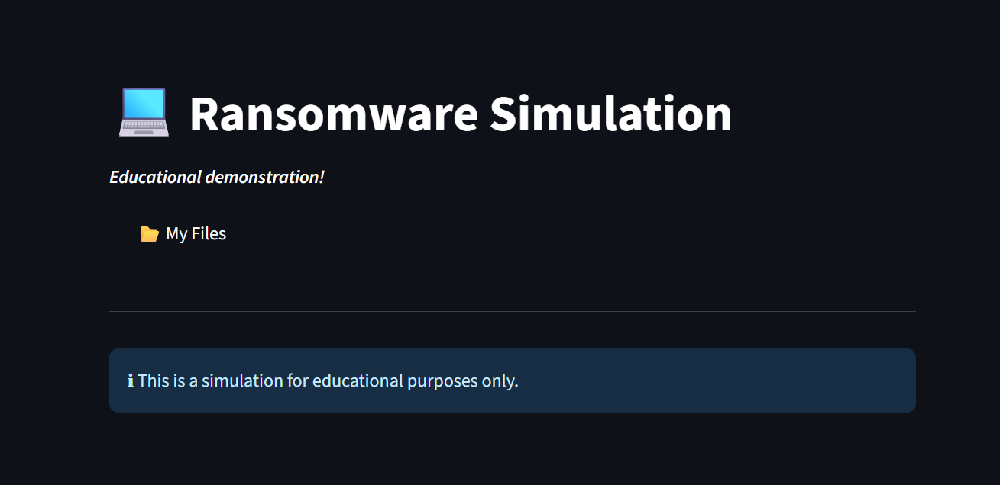
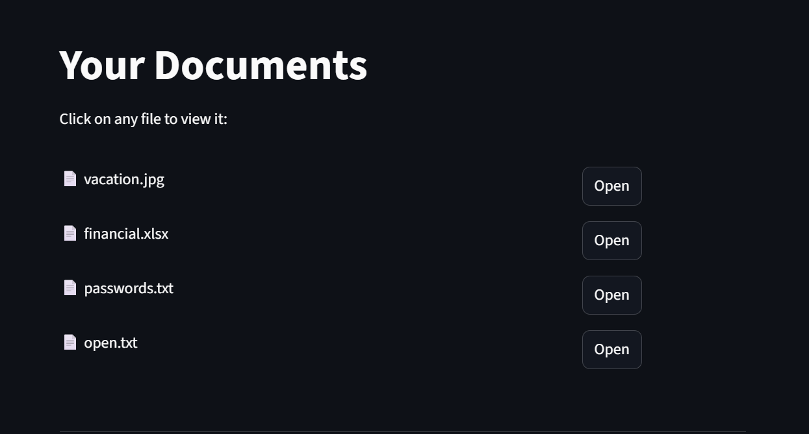
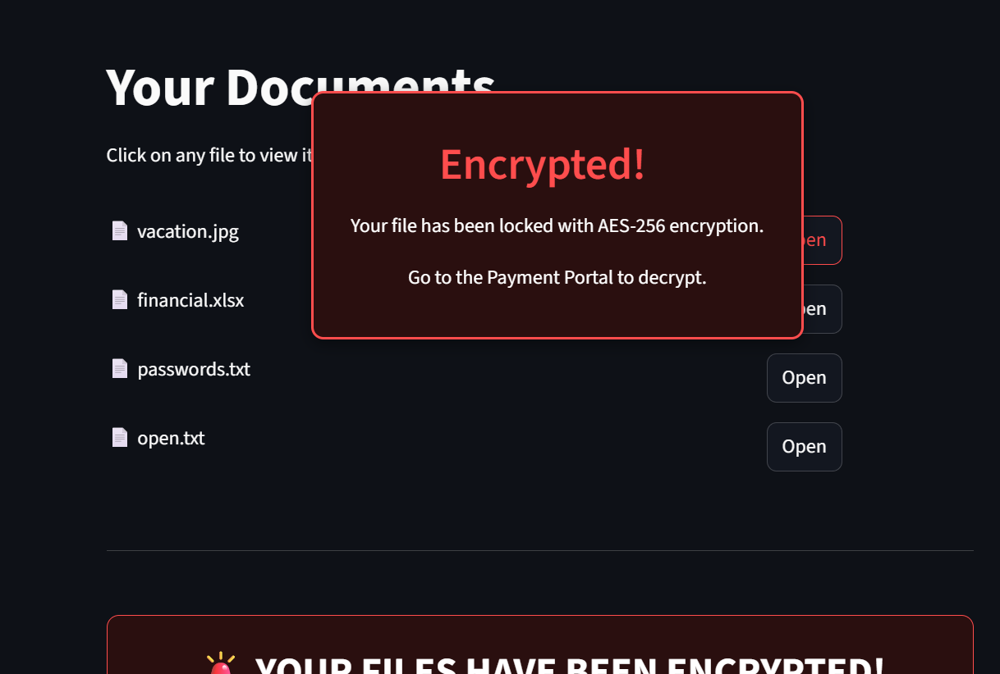
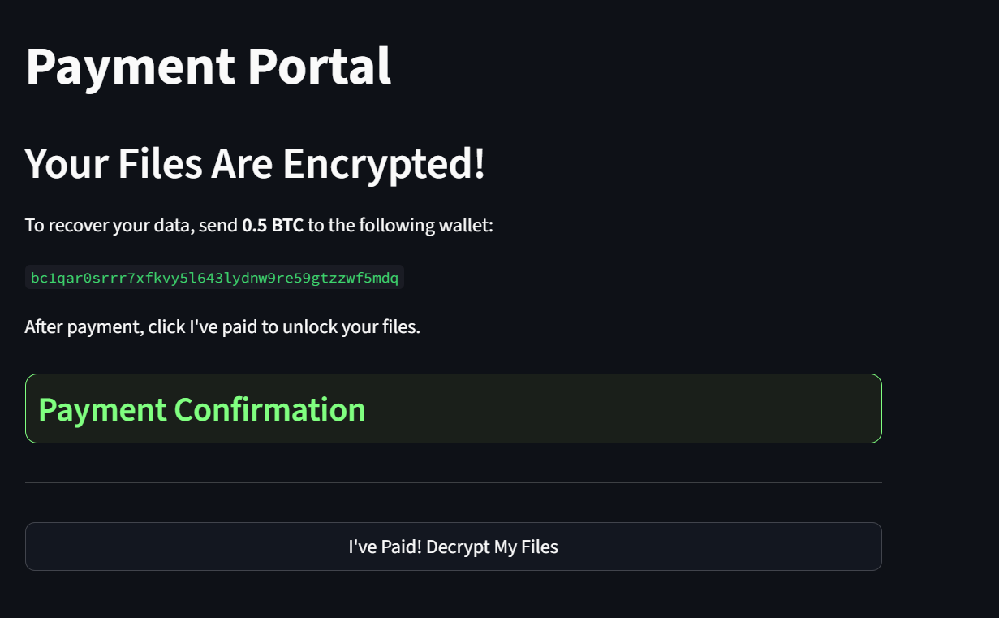

#  Ransomware Simulation – A File Encryption-Decryption Demonstrator

A Python-based ethical ransomware simulation built with Streamlit, this project mimics real-world ransomware behavior such as file encryption, ransom messages, and payment prompts — designed purely for cybersecurity awareness. What sets this simulation apart is its ability to trigger encryption **when a user attempts to open a seemingly harmless file**, emulating realistic ransomware infection tactics.

---

##  Table of Contents

1. [General Info](#general-info)  
2. [Project Status](#project-status)  
3. [Screenshots](#screenshots)  
4. [Architecture Diagram](#architecture-diagram)  
5. [Technologies Used](#technologies-used)  
6. [Requirements](#requirements)  
7. [Installation & Usage](#installation--usage)  
8. [Troubleshooting](#troubleshooting)  
9. [What Makes It Stand Out](#what-makes-it-stand-out)  
10. [FAQs](#faqs)  
11. [Recommendations for Improvement](#recommendations-for-improvement)  
12. [Acknowledgements](#acknowledgements)

---

## 🧾 General Info

This ransomware simulator demonstrates the lifecycle of a ransomware attack—from encryption to decryption—using strong AES-based encryption. The application includes a GUI built in Streamlit to show how attackers might lure users and demand ransom through fake Bitcoin wallets. It’s safe, controlled, and ideal for educational and training purposes in cybersecurity.

---

## 🚦 Project Status

- **Status:** Completed (July 2025)
- **Internship Organization:** Tamizhan Skills

---

## 🖼️ Screenshots


```markdown





````

---

## 🧱 Architecture Diagram

```plaintext
+----------------+       +---------------+       +---------------------+
|  Streamlit GUI | --->  | encrypt.py    | --->  | Encrypted User File |
+----------------+       +---------------+       +---------------------+
        |                        |                          |
        |                        v                          |
        |               salt.bin & password                 |
        |                        |                          |
        |                        v                          |
        |           decrypt.py (After Payment) ------------>|
        |                        |                          |
        +---> Decryption success message to user -----------+
```

---

## 🛠️ Technologies Used

| Tool/Library  | Purpose                            |
| ------------- | ---------------------------------- |
| Python 3      | Core scripting language            |
| Cryptography  | PBKDF2 + AES encryption via Fernet |
| Streamlit     | Interactive GUI                    |
| subprocess    | Executing file-based scripts       |

---

## 📦 Requirements

* Python 3.8 or higher

Install all dependencies:

```bash
pip install -r requirements.txt
```

`requirements.txt` contents:

```txt
streamlit==1.35.0
cryptography==42.0.5
```

---

## 🚀 Installation & Usage

1. **Clone the repository**:

```bash
git clone https://github.com/abireshu/ransomware_simulator.git
cd ransomware_simulator
```

2. **Install dependencies**:

```bash
pip install -r requirements.txt
```

3. **Run the application**:

```bash
python -m streamlit run home.py
```

4. **Simulate**:

* Choose a file → File gets encrypted
* Ransom note appears and click ok
* Click "Go to Payment"
* After mock payment, click "I've paid to decrypt the file

---

## 🔍 What Makes It Stand Out

✅ **Realistic Trigger Mechanism**
Encryption starts when a user *attempts to open a file*, simulating how ransomware exploits curiosity or negligence.

✅ **Simulated Bitcoin Ransom Portal**
Includes a dummy BTC wallet address to show how real ransomware demands payment anonymously.

✅ **PBKDF2HMAC Key Derivation with Salt**
Ensures secure and non-reversible key generation, in line with [NIST](https://nvlpubs.nist.gov/nistpubs/SpecialPublications/NIST.SP.800-132.pdf) guidelines.

✅ **Educational Purpose Only**
All encryption and decryption happens locally with user control — no actual ransomware behavior like file deletion or spreading.

✅ **Streamlit GUI for Accessibility**
A simple, clean interface suitable for demonstrations, workshops, and presentations.

---

## 🐛 Troubleshooting

| Problem                | Solution                                              |
| ---------------------- | ----------------------------------------------------- |
| `salt.bin not found`   | Ensure key generation is run before encrypting        |
| GUI doesn't open       | Run: `streamlit run gui.py` from project root         |
| File doesn't decrypt   | Double-check password and salt consistency            |
| subprocess error       | Use `["python", "encrypt.py", "file_path"]` syntax    |
| GUI input isn't hidden | Use Streamlit's `st.text_input(..., type="password")` |

---

## ❓ FAQs

**Q: Is this real ransomware?**
A: No, it’s a safe, controlled simulation for learning and awareness.

**Q: Why is Bitcoin used in the simulation?**
A: BTC is commonly used in real ransomware due to its anonymity, decentralization, and irreversible nature — making the simulation more authentic.

**Q: What happens if I lose the salt or password?**
A: The file will not be decrypted — which mimics real-world risk in secure encryption practices.

**Q: Can I use this to simulate attacks on others?**
A: Absolutely not. This is strictly for ethical and educational use only.

---

## 🧠 Recommendations for Improvement

* Add countdown timer to simulate urgency
* Integrate fake email alert system
* Add decryption success report with timestamp
* Log user actions for awareness training
* Improve cross-platform compatibility for Windows/Mac/Linux

---

## 🙏 Acknowledgements

Special thanks to the **Tamizhan Skills** team for their guidance throughout the internship and for providing the opportunity to explore secure coding and cybersecurity education in a hands-on manner.

---

## 🔖 Hashtags

`#Cybersecurity` `#Python` `#RansomwareSimulation` `#InternshipProject` `#Streamlit` `#EducationalTools`


